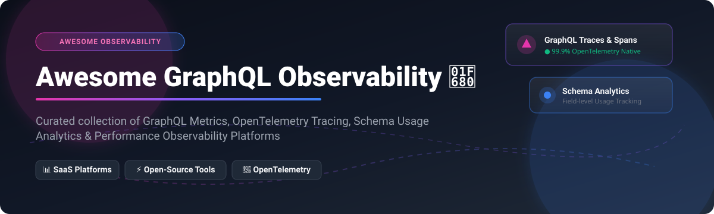

  

# 🚀 Awesome GraphQL Observability & Tracing 

  
  
  
  
  

> 📊 **A curated list of top SaaS platforms and Open-Source projects for GraphQL Observability, OpenTelemetry Tracing, Schema Usage Analytics, Performance Metrics, and Federation Visibility.**

---

## 💡 Overview & Ecosystem Insights

GraphQL observability allows API platform teams, SREs, and developers to monitor operation-level performance, field usage, resolver latency, and supergraph error rates. 

### 📈 Market Size & Industry Structure
> **Market Size & Structure Analysis:**  
> The GraphQL Observability & API Performance sector is part of the **~$5.5 Billion Global APM & Observability Market** (projected to reach **$10+ Billion by 2030**). The GraphQL-specific observability space is **moderately fragmented**: enterprise APM giants (Datadog, New Relic) co-exist with specialized GraphQL category leaders (Apollo GraphOS, GraphQL Hive, Stellate). While enterprise full-stack monitoring handles general metrics, schema-aware tracking and field-level usage analytics remain concentrated among specialized GraphQL control planes.

---

## 📑 Table of Contents

- [☁️ SaaS / Hosted Platforms](#-saas--hosted-platforms)
- [⚡ Open-Source GitHub Projects](#-open-source-github-projects)
- [🛠️ How to Contribute](#%EF%B8%8F-how-to-contribute)
- [🤝 Support & Sponsorship](#-support--sponsorship)
- [📈 Star History](#-star-history)
- [⚠️ Disclaimer](#%EF%B8%8F-disclaimer)

---

## ☁️ SaaS / Hosted Platforms

Below is the comparison of commercial SaaS offerings for GraphQL observability, ordered by **Company Scale / Valuation (Descending)**:

| Platform | Company Valuation / Revenue | Starting Paid Price | Free Tier / Trial Limits | Key Features & Focus |
| :--- | :--- | :--- | :--- | :--- |
| **[Datadog APM](https://www.datadoghq.com/)** 🐶 | **~$82 Billion** Market Cap / $4.0B ARR | **$31** per host / month (billed annually) | **14-day free trial** (Full platform access, all APM features) | Enterprise full-stack APM with GraphQL operation tracing, span indexing, and log correlation. |
| **[New Relic APM](https://newrelic.com/)** 🔮 | **~$6.18 Billion** (Acquired) / $1.0B ARR | **$0.40** per GB data ingest (beyond free tier) | **100 GB/month free ingest** forever + 1 Full Platform user | Distributed tracing and GraphQL-aware telemetry via native agents or OpenTelemetry. |
| **[Apollo GraphOS](https://www.apollographql.com/graphos)** 🚀 | **$1.5 Billion** Valuation / ~$38M ARR | **$5** per 1M requests (Developer plan) | **60 requests/min limit** + 1-day insights retention + 3 team seats | Supergraph schema registry, operation metrics, client awareness, and field-level analytics. |
| **[Hasura Cloud Metrics](https://hasura.io/)** ⚡ | **$1.0 Billion** Valuation / $139M Raised | **$99** / month (or usage-based active models) | **Free plan ($0/mo)** for dev/prototyping (limited project scale & passthrough) | Instant GraphQL engine observability, execution trace breakdown, and role-based metrics. |
| **[Stellate](https://stellate.co/)** 🌐 | **~$25 Million** Funding | **$249** / month (includes 25M metrics requests) | **100,000 requests/month free** forever | Edge GraphQL CDN & gateway with request-level metrics, caching analytics, and rate limiting. |
| **[GraphQL Hive Cloud](https://the-guild.dev/graphql/hive)** 🐝 | **The Guild** (Bootstrapped Open Core Leaders) | **$20** / month base (includes 1M ops, +$10/1M extra) | **1,000,000 operations/month free** forever (7-day data retention) | Open-core schema registry, operation usage reporting, federation checks, and gateway analytics. |
| **[Grafbase](https://grafbase.com/)** 📐 | **$7.3 Million** Funding / $2.6M Valuation | **Contact Sales** (Custom tier after trial) | **60-day free trial** (Full edge & federated GraphQL features) | Serverless edge GraphQL platform with built-in analytics, tracing, and federated graph insights. |

---

## ⚡ Open-Source GitHub Projects

Curated open-source GraphQL observability components, tracing frameworks, and telemetry backends, ordered by **GitHub Stars_Count (Descending)**:

| Project | GitHub_Stars | Description | Category |
| :--- | :--- | :--- | :--- |
| **[Grafana](https://github.com/grafana/grafana)** 📊 |  | Open-source visualization and dashboarding platform with rich GraphQL plugin & OTLP support. | Metrics & Dashboards |
| **[Prometheus](https://github.com/prometheus/prometheus)** 🔥 |  | Systems monitoring and time-series database with widespread exporters for GraphQL servers. | Metrics Collection |
| **[Hasura GraphQL Engine](https://github.com/hasura/graphql-engine)** ⚡ |  | Fast GraphQL server on Postgres/SQL with built-in OpenTelemetry & Prometheus metric exporters. | GraphQL Server & Engine |
| **[Jaeger Tracing](https://github.com/jaegertracing/jaeger)** 🕵️ |  | CNCF end-to-end distributed tracing backend for storing and visualizing GraphQL spans. | Tracing Backend |
| **[Apollo Server](https://github.com/apollographql/apollo-server)** 🛡️ |  | Spec-compliant GraphQL server with open plugins for inline tracing, usage reporting, and OTel. | GraphQL Server |
| **[GraphQL Yoga](https://github.com/dotansimha/graphql-yoga)** 🧘 |  | Fully featured Node.js/Bun GraphQL server powered by Envelop plugins for OpenTelemetry & logging. | GraphQL Server |
| **[OpenTelemetry Collector](https://github.com/open-telemetry/opentelemetry-collector)** 🔭 |  | Proxy vendor-agnostic collector to receive, process, and export GraphQL traces/metrics. | Telemetry Pipeline |
| **[Grafana Tempo](https://github.com/grafana/tempo)** ⏱️ |  | High-scale, cost-effective distributed tracing backend deeply integrated with Grafana. | Tracing Backend |
| **[OpenTelemetry JS Contrib](https://github.com/open-telemetry/opentelemetry-js-contrib)** 🧰 |  | Official OpenTelemetry instrumentation modules for GraphQL execution engines & HTTP servers. | Instrumentation |
| **[GraphQL Hive Console](https://github.com/kamilkisiela/graphql-hive)** 🐝 |  | Open-source (MIT) schema registry, operation usage analytics platform, and gateway control plane. | Schema & Usage Control |

---

## 🛠️ How to Contribute

Contributions are super welcome! 🌟 Follow these simple steps:

1. 🍴 **Fork** this repository.
2. 📝 **Add or update** entries in `README.md` following the standard table formatting.
3. 🔎 Ensure all links, pricing details, and Stars_Badges are accurate.
4. 🚀 Submit a **Pull Request** with a clear title and description.

---

## 🤝 Support & Sponsorship

If you found this awesome list helpful, please consider supporting the project:

- ⭐ **Star** this repository to show your appreciation!
- 🔀 **Fork** and share with your API development & DevOps teams.
- ☕ **Sponsor / Buy me a coffee:** 

Thank you for helping keep the GraphQL & Observability ecosystem open and accessible! ❤️

---

## 📈 Star History

---

## ⚠️ Disclaimer

- This list is **community-curated** for educational & architectural reference purposes.
- Observability and APM systems process operational API traffic; ensure compliance with data security, GDPR, and privacy standards when capturing GraphQL payloads or variables.
